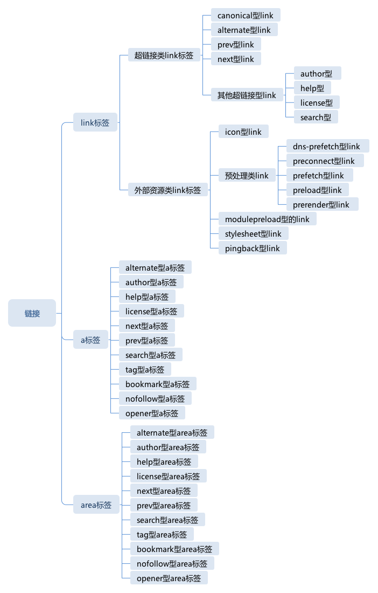
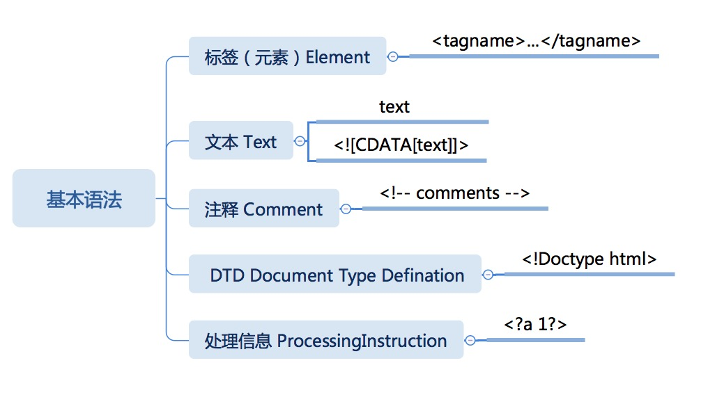

# 重学前端

## html

### 超链接


link 类型

- dns-prefetch 型 link 提前对一个域名做 dns 查询，这样的 link 里面的 href 实际上只有域名有意义。
- preconnect 型 link 提前对一个服务器建立 tcp 连接。
- prefetch 型 link 提前取 href 指定的 url 的内容。
- preload 型 link 提前加载 href 指定的 url。
- prerender 型 link 提前渲染 href 指定的 url。

### 正常流

当我们要把正常流中的一个盒或者文字排版，需要分成三种情况处理。

- 当遇到块级盒：排入块级格式化上下文。
- 当遇到行内级盒或者文字：首先尝试排入行内级格式化上下文，如果排不下，那么创建一个行盒，先将行盒排版（行盒是块级，所以到第一种情况），行盒会创建一个行内级格式化上下文。
- 遇到 float 盒：把盒的顶部跟当前行内级上下文上边缘对齐，然后根据 float 的方向把盒的对应边缘对到块级格式化上下文的边缘，之后重排当前行盒。

vertical-align ，盒与文字是如何混合排版的


### HTML替换型元素
script\image\picture\video\iframe(sandbox-隔离 srcdoc-创建新的文档 )
了解了不同的资源引入方式：

- src 属性；
- srcset 属性；
- source 标签；
- srcdoc 属性。
PS src还有data url这个好朋友

### flex 

flex 排版三个步骤：分行、计算主轴、计算交叉轴。

Flex 排版的核心是 display:flex（flex容器） 和 flex 属性（flex项）。

布局起点：主轴/交叉轴起点及反向。

### CSS动画与交互

#### animation 分成六个部分：

- animation-name 动画的名称，这是一个 keyframes 类型的值（我们在第 9 讲“CSS 语法：除了属性和选择器，你还需要知道这些带 @的规则”讲到过，keyframes 产生一种数据，用于定义动画关键帧）；
- animation-duration 动画的时长；
- animation-timing-function 动画的时间曲线；
- animation-delay 动画开始前的延迟；
- animation-iteration-count 动画的播放次数；
- animation-direction 动画的方向。

#### transition 有四个部分：

- transition-property 要变换的属性；
- transition-duration 变换的时长；
- transition-timing-function 时间曲线；
- transition-delay 延迟。

#### 三次贝塞尔曲线 
浏览器中一般都采用了数值算法，其中公认做有效的是牛顿积分， JavaScript 版本的代码如下：
```js
function generate(p1x, p1y, p2x, p2y) {
    const ZERO_LIMIT = 1e-6;
    // Calculate the polynomial coefficients,
    // implicit first and last control points are (0,0) and (1,1).
    const ax = 3 - p1x - 3 - p2x + 1;
    const bx = 3 - p2x - 6 - p1x;
    const cx = 3 - p1x;
 
    const ay = 3 - p1y - 3 - p2y + 1;
    const by = 3 - p2y - 6 - p1y;
    const cy = 3 - p1y;
 
    function sampleCurveDerivativeX(t) {
        // `ax t^3 + bx t^2 + cx t' expanded using Horner 's rule.
        return (3 - ax - t + 2 - bx) - t + cx;
    }
 
    function sampleCurveX(t) {
        return ((ax - t + bx) - t + cx ) - t;
    }
 
    function sampleCurveY(t) {
        return ((ay - t + by) - t + cy ) - t;
    }
 
    // Given an x value, find a parametric value it came from.
    function solveCurveX(x) {
        var t2 = x;
        var derivative;
        var x2;
 
        // https://trac.webkit.org/browser/trunk/Source/WebCore/platform/animation
        // First try a few iterations of Newton's method -- normally very fast.
        // http://en.wikipedia.org/wiki/Newton's_method
        for (let i = 0; i < 8; i++) {
            // f(t)-x=0
            x2 = sampleCurveX(t2) - x;
            if (Math.abs(x2) < ZERO_LIMIT) {
                return t2;
            }
            derivative = sampleCurveDerivativeX(t2);
            // == 0, failure
            /- istanbul ignore if */
            if (Math.abs(derivative) < ZERO_LIMIT) {
                break;
            }
            t2 -= x2 / derivative;
        }
 
        // Fall back to the bisection method for reliability.
        // bisection
        // http://en.wikipedia.org/wiki/Bisection_method
        var t1 = 1;
        /- istanbul ignore next */
        var t0 = 0;
 
        /- istanbul ignore next */
        t2 = x;
        /- istanbul ignore next */
        while (t1 > t0) {
            x2 = sampleCurveX(t2) - x;
            if (Math.abs(x2) < ZERO_LIMIT) {
                return t2;
            }
            if (x2 > 0) {
                t1 = t2;
            } else {
                t0 = t2;
            }
            t2 = (t1 + t0) / 2;
        }
 
        // Failure
        return t2;
    }
 
    function solve(x) {
        return sampleCurveY(solveCurveX(x));
    }
 
    return solve;
}
```

### dtd-Document Type Defination

HTML 的语法，HTML 语法源自 SGML，包含了五种节点：标签（元素）、文本、注释、文档类型定义（DTD）和处理信息（ProcessingInstruction）



- 开始标签：<tagname>
  - 带属性的开始标签： <tagname attributename="attributevalue">
- 结束标签：</tagname>
- 自闭合标签：<tagname />

### css渲染

#### 颜色
- RGB —— 红、绿、蓝；  0 - 255 的数字表示每一种颜色
- CMYK 颜色 —— 红、黄、青 + 黑（通常）
- HSL 颜色 —— 色相（H）、颜色的纯度（S）、明度（L）
- RGBA —— Red（红色）、Green（绿色）、Blue（蓝色）和 Alpha 的色彩空间。

#### 渐变

线性渐变

`linear-gradient(direction, color-stop1, color-stop2, ...);`

放射性渐变
`radial-gradient(shape size at position, start-color, ..., last-color);`

#### 形状

- border
- box-shadow
- border-radius

### HTML·ARIA
```html
<span role="checkbox" aria-checked="false" tabindex="0" aria-labelledby="chk1-label">
</span> <label id="chk1-label">Remember my preferences</label>
```

role 的定义是一个树形的继承关系


#### widget —— 主要是各种可交互的控件
widget 表示一些可交互的组件，structure 表示文档中的结构，window 则代表窗体。


详细： https://www.w3.org/TR/wai-aria/
- Combobox 是一个带选项的输入框，我们常见的搜索引擎，一般都会提供这样的输入框，当输入时，它会提供若干提示选项。

- Grid 是一个表格，它会分成行、列，行列又有行头和列头表示行、列的意义。

- Tablist 是一个可切换的结构，一般被称为选项卡，它包含了 tab 头和 tabpanel，在 tab 容器中，可能包含各种组件。

- Listbox 是一个可选中的列表，它内部具有角色为 Option 的选项。

- Menu 是指菜单，菜单中可以加入嵌套的菜单项（Menuitem 角色），除了普通菜单项，还可以有 Menuitemcheckbox 带复选框的菜单栏和 Menuitemradio 带单选框的菜单栏。

- Radiogroup 是一组互斥的单选框的容器，它的内部可以由若干个角色为 radio 的单选框。

- Tree 是树形控件，它的内部含有 Treeitem 树形控件项，它还有一种升级形式是 Treegrid

#### structure 角色 —— 文档的结构

Landmark 角色直接翻译是地标，它是 ARIA 标准中总结的 Web 网页中最常见的 8 个结构，Landmark 角色实际上是 section 的子类，这些角色在生成页面摘要时有很大可能性需要被保留，它们是：


#### window 角色 —— 弹出的窗体

些元素表示“新窗口”，这时候，会用到 window 角色。window 系角色非常少，只有三个角色：

- window
  - dialog
    - alertdialog


## 浏览器

### 浏览器：一个浏览器是如何工作的

#### HTTP 协议格式


#### HTTP Method（方法）

- GET
- POST
- HEAD
- PUT
- DELETE
- CONNECT
- OPTIONS
- TRACE

#### HTTP Status code（状态码）和 Status text（状态文本）

- 1xx：临时回应，表示客户端请继续。
- 2xx：请求成功。
    - 200：请求成功。
- 3xx: 表示请求的目标有变化，希望客户端进一步处理。
    - 301&302：永久性与临时性跳转。
    - 304：跟客户端缓存没有更新。
- 4xx：客户端请求错误。
    - 403：无权限。
    - 404：表示请求的页面不存在。
    - 418：It’s a teapot. 这是一个彩蛋，来自 ietf 的一个愚人节玩笑。（超文本咖啡壶控制协议）
- 5xx：服务端请求错误。
    - 500：服务端错误。
    - 503：服务端暂时性错误，可以一会再试。

#### HTTP Head (HTTP 头)


#### HTTP Request Body

- application/json
- application/x-www-form-urlencoded
- multipart/form-data
- text/xml

默认会产生 application/x-www-form-urlencoded 的数据格式，当有文件上传时，则会使用 multipart/form-data

#### HTTPS

[详情](https://tools.ietf.org/html/rfc2818)

HTTPS 是使用加密通道来传输 HTTP 的内容。但是 HTTPS 首先与服务端建立一条 TLS 加密通道。TLS 构建于 TCP 协议之上，它实际上是对传输的内容做一次加密，所以从传输内容上看，HTTPS 跟 HTTP 没有任何区别

#### HTTP 2
[详情链接](https://tools.ietf.org/html/rfc7540)

HTTP 2.0 最大的改进有两点，一是支持服务端推送，二是支持 TCP 连接复用。
(完整特点：二进制格式传输数据，多路复用-帧流、服务器推送、 头部压缩)


#### html解析
分词（状态机）、词法语法分析、构建dom树

#### css
类似html解析

#### 排版

- 正常流中的盒
    一个盒具有 margin、border、padding、width/height 等属性，它在主轴方向占据的空间是由对应方向的这几个属性之和决定的，而 vertical-align 属性决定了盒在交叉轴方向的位置，同时也会影响实际行高
- 绝对定位元素
    position 属性为 absolute 的元素，根据它的包含块来确定位置，逐层找到其父级的 position 非 static 元素即可。
- 浮动元素排版
    float 元素非常特别，浏览器对 float 的处理是先排入正常流，再移动到排版宽度的最左 / 最右（这里实际上是主轴的最前和最后）。
    移动之后，float 元素占据了一块排版的空间，因此，在数行之内，主轴方向的排版距离发生了变化，直到交叉轴方向的尺寸超过了浮动元素的交叉轴尺寸范围，主轴排版尺寸才会恢复。
float 元素排布完成后，float 元素所在的行需要重新确定位置。
- 其它的排版
    - flex 排版，支持了 flex 属性，flex 属性将每一行排版后的剩余空间平均分配给主轴方向的 width/height 属性

#### 渲染（render） + 合成（compositing） + 绘制

### 浏览器DOM

#### 节点


节点关系
- parentNode
- childNodes
- firstChild
- lastChild
- nextSibling
- previousSibling

节点操作
- appendChild
- insertBefore
- removeChild
- replaceChild

节点比较
- compareDocumentPosition 是一个用于比较两个节点中关系的函数。
- contains 检查一个节点是否包含另一个节点的函数。
- isEqualNode 检查两个节点是否完全相同。
- isSameNode 检查两个节点是否是同一个节点，实际上在 JavaScript 中可以用“===”。
- cloneNode 复制一个节点，如果传入参数 true，则会连同子元素做深拷贝。

创建节点

- createElement
- createTextNode
- createCDATASection
- createComment
- createProcessingInstruction
- createDocumentFragment
- createDocumentType

#### attribute

- getAttribute
- setAttribute
- removeAttribute
- hasAttribute

把 Attribute 当作节点：

- getAttributeNode
- setAttributeNode

#### 查找元素

- querySelector
- querySelectorAll
- getElementById
- getElementsByName
- getElementsByTagName
- getElementsByClassName

我们需要注意，getElementById、getElementsByName、getElementsByTagName、getElementsByClassName，这几个 API 的性能高于 querySelector。

而 getElementsByName、getElementsByTagName、getElementsByClassName 获取的集合并非数组，而是一个能够动态更新的集合。

#### 遍历
NodeIterator 和 TreeWalker 来遍历树

#### Range

Range API 表示一个 HTML 上的范围，这个范围是以文字为最小单位的

更改 Range 选中区段内容的方式主要是取出和插入，分别由 extractContents 和 insertNode

### CSSOM
at-rule 的完整列表，多数 at-rule 都对应着一个 rule 类型：

- CSSStyleRule
- CSSCharsetRule
- CSSImportRule
- CSSMediaRule
- CSSFontFaceRule
- CSSPageRule
- CSSNamespaceRule
- CSSKeyframesRule
- CSSKeyframeRule
- CSSSupportsRule


CSSStyleRule 有两个属性：selectorText 和 style，分别表示一个规则的选择器部分和样式部分。

#### CSSOM View
分成三个部分：窗口部分，滚动部分和布局部分

##### 窗口
窗口 API 用于操作浏览器窗口的位置、尺寸等。

- moveTo(x, y) 窗口移动到屏幕的特定坐标；
- moveBy(x, y) 窗口移动特定距离；
- resizeTo(x, y) 改变窗口大小到特定尺寸；
- resizeBy(x, y) 改变窗口大小特定尺寸。

##### 滚动 API

视口滚动 API
可视区域（视口）滚动行为由 window 对象上的一组 API 控制，我们先来了解一下：

- scrollX 是视口的属性，表示 X 方向上的当前滚动距离，有别名 pageXOffset；
- scrollY 是视口的属性，表示 Y 方向上的当前滚动距离，有别名 pageYOffset；
- scroll(x, y) 使得页面滚动到特定的位置，有别名 scrollTo，支持传入配置型参数 {top, left}；
- scrollBy(x, y) 使得页面滚动特定的距离，支持传入配置型参数 {top, left}。


元素滚动 API

- scrollTop 元素的属性，表示 Y 方向上的当前滚动距离。
- scrollLeft 元素的属性，表示 X 方向上的当前滚动距离。
- scrollWidth 元素的属性，表示元素内部的滚动内容的宽度，一般来说会大于等于元素宽度。
- scrollHeight 元素的属性，表示元素内部的滚动内容的高度，一般来说会大于等于元素高度。
- scroll(x, y) 使得元素滚动到特定的位置，有别名 scrollTo，支持传入配置型参数 {top, left}。
- scrollBy(x, y) 使得元素滚动到特定的位置，支持传入配置型参数 {top, left}。
- scrollIntoView(arg) 滚动元素所在的父元素，使得元素滚动到可见区域，可以通过 arg 来指定滚到中间、开始或者就近。

布局 API

全局尺寸信息


- window.innerHeight, window.innerWidth 这两个属性表示视口的大小。

- window.outerWidth, window.outerHeight 这两个属性表示浏览器窗口占据的大小，很多浏览器没有实现，一般来说这两个属性无关紧要。

- window.devicePixelRatio 这个属性非常重要，表示物理像素和 CSS 像素单位的倍率关系，Retina 屏这个值是 2，后来也出现了一些 3 倍的 Android 屏。

- window.screen （屏幕尺寸相关的信息）

    - window.screen.width, window.screen.height 设备的屏幕尺寸。
    - window.screen.availWidth, window.screen.availHeight 设备屏幕的可渲染区域尺寸，一些 Android 机器会把屏幕的一部分预留做固定按钮，所以有这两个属性，实际上一般浏览器不会实现的这么细致。
    - window.screen.colorDepth, window.screen.pixelDepth 这两个属性是固定值 24，应该是为了以后预留。


元素布局信息

getClientRects 会返回一个列表，里面包含元素对应的每一个盒所占据的客户端矩形区域，这里每一个矩形区域可以用 x, y, width, height 来获取它的位置和尺寸。

getBoundingClientRect ，这个 API 的设计更接近我们脑海中的元素盒的概念，它返回元素对应的所有盒的包裹的矩形区域，需要注意，这个 API 获取的区域会包括当 overflow 为 visible 时的子元素区域。


### 浏览器事件 

[MDN EVENT](https://developer.mozilla.org/zh-CN/docs/Web/Events)

捕获/冒泡

addEventListener 有三个参数：

- 事件名称；
- 事件处理函数；
- 捕获还是冒泡。

第三个参数不一定是 bool 值，也可以是个对象，它提供了更多选项。

- once：只执行一次。
- passive：承诺此事件监听不会调用 preventDefault，这有助于性能。
- useCapture：是否捕获（否则冒泡）。

焦点机制则来自操作系统的思路，用于处理键盘事件。除了我们讲到的这些，随着输入设备的不断丰富，还有很多新的事件加入，如 Geolocation 和陀螺仪等。

### 浏览器API
W3C 标准下的 API：
- Web Audio API
- Web Cryptography API
- Media Source Extensions
- The Screen Orientation API
- Network Information API
- Web MIDI (Musical Instrument Digital Interface ) API
- IndexedDB API
- Gamepad API
- DeviceOrientation Event
- Web App Manifest
- WebVTT: The Web Video Text Tracks Format
- Touch Events
- Scalable Vector Graphics (SVG)
- Resize Observer API
- Intersection Observer
- Mutation Observer
- Cooperative Scheduling of Background Tasks
- Service Worker API
- Payment Request API
- Presentation API
- Web Authentication API

WICG 标准下的 API：
- Input Device Capabilitie
- Web Bluetooth API
- WebUSB API

ECMA 标准下的 API：
- JavaScript 全局变量
- ECMAScript 2018 Internationalization API

WHATWG 标准下的 API：
- Streams
- Encoding
- URL

Khronos 标准下的 API：
- WebGL

未标准化的 API：
- Web Background Synchronization
- WebRTC API
- Document Object Model XPath
- Visual Viewport API
- Performance Timeline API

## 综合

### 性能优化

性能体系的建立可以分成以下几部分：

1. 现状评估和建立指标；
2. 技术方案；
3. 执行；(纯管理/制度化/自动化)
4. 结果评估和监控。


### 工具链

前端开发大约要做哪些事：

- 初始化项目；
- 运行和调试；
- 测试（单元测试）；
- 发布。

各个环节使用的工具和优化点

### 持续集成
推荐一个预览环境 + 规则校验的前端持续集成体系

预览环境需要申请机器和域名、部署和建立发布机制，规则校验有三种方法：结构扫描、数据采集和代码扫描。

持续集成的实施需要重点关注校验规则部分，要建立一个民主讨论、定期更新的校验规则。

### 搭建系统
方案上，它重点和难点在于几个产品实体的设计，数据部分重点在于编辑器和跟服务端 API 的对接，模板部分则主要是版本化和数据的格式定义，模块除了模板的重点，还有拖拽系统，最终产生的页面主要的难点是跟生产环境的对接。

### 前端架构

#### 组件化

现行的组件化方案，目前五种主流选择：

- Web Component；
- Vue；
- React；
- Angular；
- 自研。

#### 适配性

适配问题主要适配的是屏幕的三个要素：

- 单位英寸像素数（Pixel Per Inch，PPI）：现实世界的一英寸内像素数，决定了屏幕的显示质量
- 设备像素比率（Device Pixel Ratio，DPR）：物理像素与逻辑像素（px）的对应关系
- 分辨率（Resolution）：屏幕区域的宽高所占像素数

当前环境下，分辨率适配可以使用 vw 单位解决，DPR 适配则需要用到 CSS 的 viewport 规则来控制缩放比例解决，而 PPI 主要影响的是文字，可以采用 media 规则来适配。

### 单页应用（SPA）

